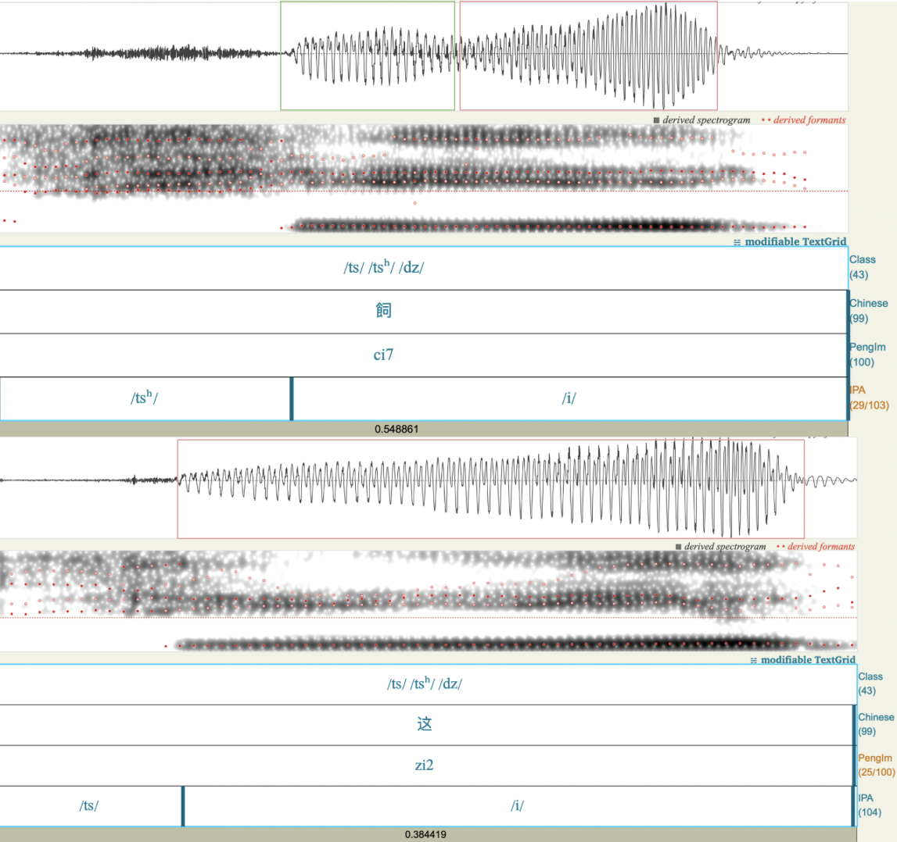
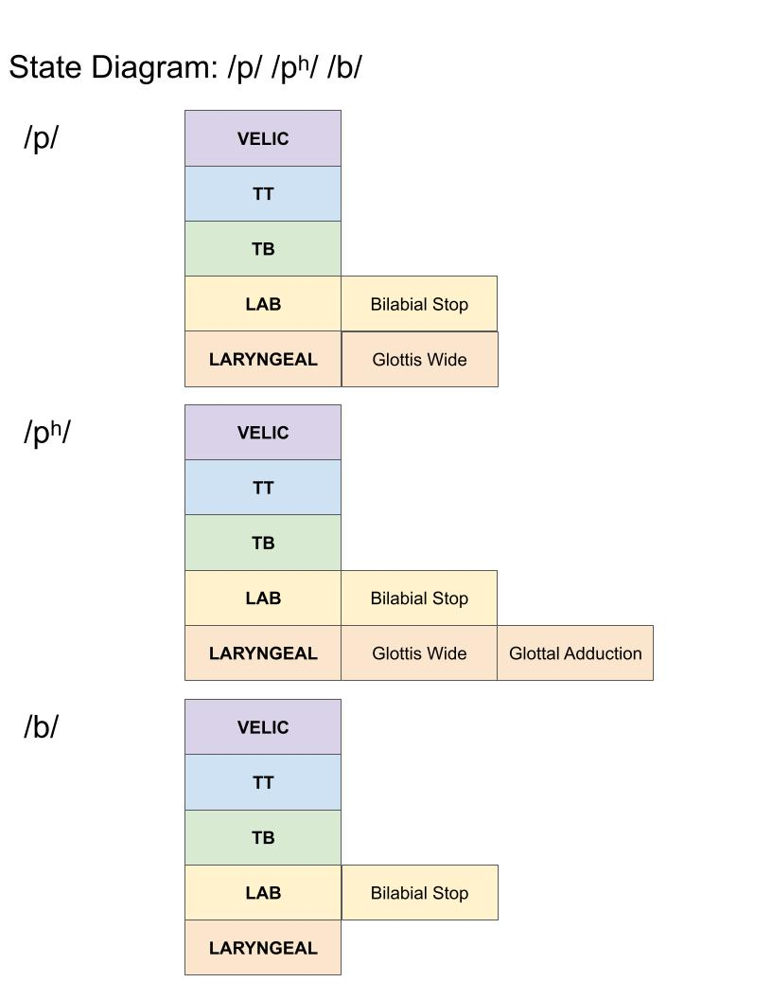
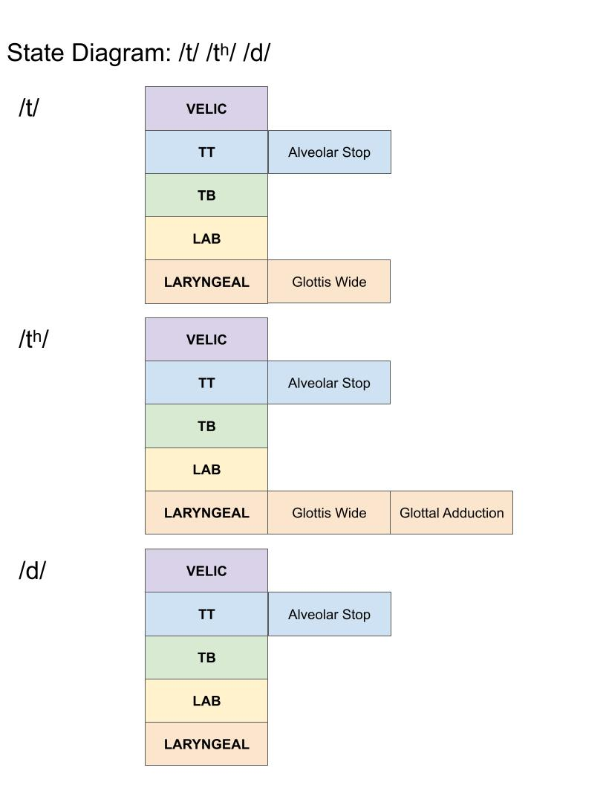
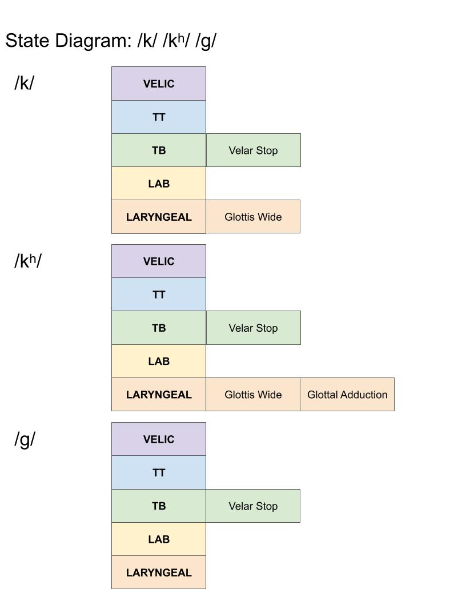
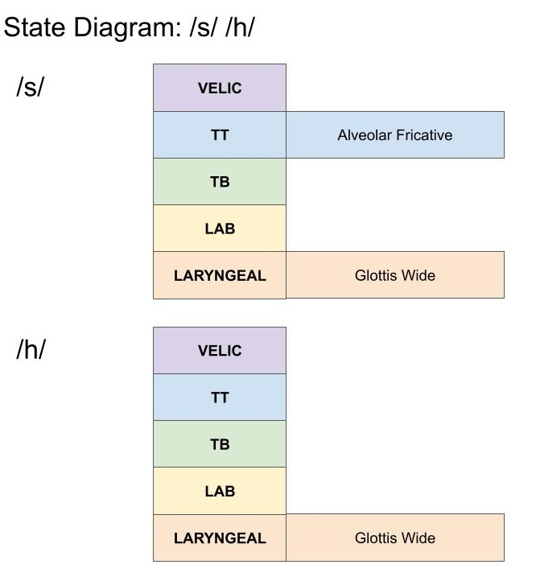
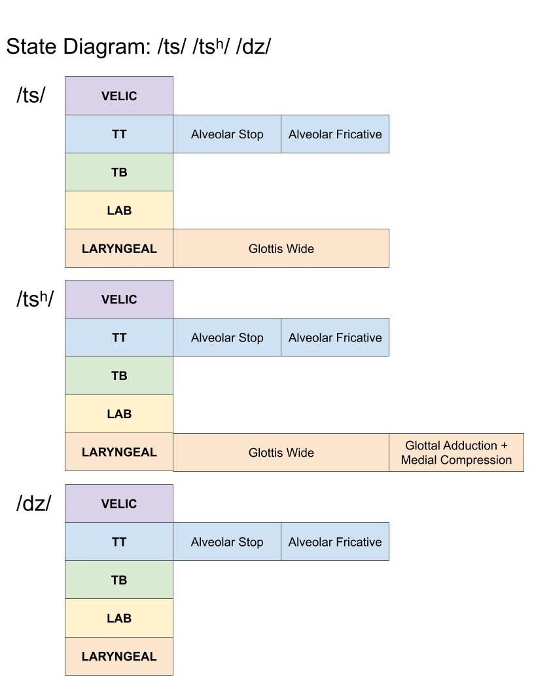

# Consonants

<details open markdown="block">
  <summary>
    Table of contents
  </summary>
  {: .text-delta }
1. TOC
{:toc}
</details>

___
# List of Consonants 
- Initial list of consonants and common phrases to illustrate the relationship between the `Peng'im` and IPA transcriptions[^1]

| IPA         | Peng’im | IPA Transcription | Peng’im Transcription | SwaTao Gloss | Mandarin Gloss | English Gloss                                                         |
| ----------- | ------- | ----------------- | --------------------- | ------------ | -------------- | --------------------------------------------------------------------- |
| /p/         | b       | /pa/              | a1ba1                 | 阿爸           | 爸爸             | Dad                                                                   |
| /pʰ/        | p       | /pʰoʊ/            | pou1                  | 铺            | 铺              | To spread a cloth                                                     |
| /b/         | bh      | /buaŋ/            | bhuang7               | 万            | 万              | 10,000                                                                |
| /t/         | d       | /di gɔ/           | di7 go3               | 底块           | 哪里             | Where                                                                 |
| /tʰ/        | t       | /suã taʊ/         | suan1 tao5            | 汕头           | 汕头             | Swa Tao (Dialect and Region)                                          |
| /ts/        | z       | /tsek/            | zêg8                  | 一            | 一              | 1                                                                     |
| /tsʰ/       | c       | /tsʰik/           | cig4                  | 七            | 七              | 7                                                                     |
| /z/ or /dz/ | r       | /dzi/             | ri7                   | 字            | 字              | Word                                                                  |
| /k/         | g       | /kau/             | gao2                  | 九            | 九              | 9                                                                     |
| /kʰ/        | k       | /gɯŋ kɯe/         | gong1 kue3            | 功课           | 功课             | Homework                                                              |
| /g/         | gh      | /gaɪ/             | gai5                  | 个            | 个              | Particle (What/thing)                                                 |
| /ʔ/         | -h      | /hiẽ/             | hiên1                 | 乡            | 乡              | Village                                                               |
| /m/         | m       | /mi/              | mih8                  | 乜            | 什么             | Particle (What/thing)                                                 |
| /n/         | n       | /no/              | no6                   | 兩            | 兩              | 2                                                                     |
| /ŋ/         | ng      | /ŋou/             | ngou6                 | 五            | 五              | 5                                                                     |
|             |         | /ŋaŋ/             | ngang5                | 凝            | 冷              | In Cantonese/Mandarin means to coagulate, in Teochew means to be cold |
| /s/         | s       | /sã/              | san1                  | 三            | 三              | 3                                                                     |
| /h/         | h       | /hak/             | hak4                  | 学            | 学              | Learn/School                                                          |
| /l/         | l       | /leŋ/             | lêng5                 | 零            | 零              | 0                                                                     |

# Phonetically Rich Sentences
In order to illustrate the phonetic contrasts of phonemes (ex: `/p/` vs. `/pʰ/` vs. `/b/`), the speaker produced the sentences below. Note: Since `Learn Teochew` is based off of `Teochew Proper` [video tutorials](https://www.youtube.com/watch?v=xAB_7Y5iDkc&list=PLvDAIRuHzfHmoiwE2EuGJQjgHuqGzzp7B&pp=iAQB), the transcriptions were updated after analyzing the speaker's segments in [Praat](https://www.fon.hum.uva.nl/praat/).

## Labial Stops `/p/` `/pʰ/` `/b/`

| IPA Transcription                                                              | Peng’im Transcription                                                         | SwaTao Gloss                                      | Chinese Gloss                                    | English Gloss                                                        |
| ------------------------------------------------------------------------------ | ----------------------------------------------------------------------------- | ------------------------------------------------- | ------------------------------------------------ | -------------------------------------------------------------------- |
| /i gaɪ/<br><br>/boʊ/<br><br>/dɯɔ/<br><br>/tsʌŋ deŋ/<br><br>/pʰoʊ/<br><br>/poʊ/ | i1-gai5 <br><br>bhou2 <br><br>do6 <br><br>ceng1-dêng2<br><br>pou1<br><br>bou3 | 一个<br><br>𡚸<br><br>在<br><br>床顶<br><br>铺<br><br>补 | 你的<br><br>妻子<br><br>在<br><br>床<br><br>单<br><br>铺 | Your<br><br>Wife<br><br>Is<br><br>Bed<br><br>Sheet <br><br>Spreading |

## Alveolar Stops `/tʰ/` `/t/ `

| IPA Transcription                                                     | Peng’im Transcription                                                 | SwaTao Gloss                                   | Chinese Gloss                                  | English Gloss                                                          |
| --------------------------------------------------------------------- | --------------------------------------------------------------------- | ---------------------------------------------- | ---------------------------------------------- | ---------------------------------------------------------------------- |
| /tʰaʊ/<br><br>/ge/<br><br>/aɪ/<br><br>/pɯe/<br><br>/tau:/<br><br>/ge/ | tao5<br><br>gê1 <br><br>ai3 <br><br>Buê2 boi <br><br>dao7<br><br>ghê6 | 头<br><br>家<br><br>爱<br><br>买<br><br>豆<br><br>芽 | 老<br><br>板<br><br>爱<br><br>买<br><br>豆<br><br>芽 | The<br><br>Boss<br><br>Likes<br><br>Selling<br><br>Bean<br><br>Sprouts |

## Velar Stops `/k/` `/kʰ/` `/g/`[^2]

| IPA Transcription                                                  | Peng’im Transcription                                          | SwaTao Gloss                                   | Chinese Gloss                                  | English Gloss                                               |
| ------------------------------------------------------------------ | -------------------------------------------------------------- | ---------------------------------------------- | ---------------------------------------------- | ----------------------------------------------------------- |
| /kɯ/<br><br>/mɪŋ/<br><br>/kʰɯ/<br><br>/o/<br><br>/hoʔ/<br><br>/gɯ/ | gê1<br><br>ming1<br><br>ke3<br><br>oh8<br><br>gog4<br><br>ghe2 | 居<br><br>民<br><br>去<br><br>学<br><br>国<br><br>语 | 居<br><br>民<br><br>去<br><br>学<br><br>国<br><br>语 | Resident<br><br>  <br><br>Goes<br><br>Learn<br><br>Mandarin |

## Alveolar Affricates `/ts/` `/tsʰ/` `/dz/`

| IPA Transcription                                                                                                           | Peng’im Transcription                                                                                          | SwaTao Gloss                                                                         | Chinese Gloss                                                                      | English Gloss                                                                                                  |
| --------------------------------------------------------------------------------------------------------------------------- | -------------------------------------------------------------------------------------------------------------- | ------------------------------------------------------------------------------------ | ---------------------------------------------------------------------------------- | -------------------------------------------------------------------------------------------------------------- |
| /wa/<br><br>/tsi/<br><br>/tsɯŋ/<br><br>/luo/<br><br>/tsʰi/<br><br>/kiã/<br><br>/bo/<br><br>/piaŋ/<br><br>/sia/<br><br>/dzi/ | ua2<br><br>zi2<br><br>hue5<br><br>lo1<br><br>ci7<br><br>gian2<br><br>bho5<br><br>biang3<br><br>sia2<br><br>ri7 | 我<br><br>这<br><br>回<br><br>啰<br><br>飼<br><br>仔 <br><br>無<br><br>變 <br><br>寫<br><br>字 | 我<br><br>在<br><br>  <br>  <br><br>喂<br><br>孩子<br><br>不<br><br>方便<br><br>写<br><br>字 | I<br><br>Am<br><br>  <br>  <br><br>Feeding<br><br>Child<br><br>Not<br><br>Convenient<br><br>Write<br><br>Words |

## Fricatives `/s/``/h/`

| IPA Transcription                                                                             | Peng’im Transcription                                                                     | SwaTao Gloss                                                     | Chinese Gloss                                                         | English Gloss                                               |
| --------------------------------------------------------------------------------------------- | ----------------------------------------------------------------------------------------- | ---------------------------------------------------------------- | --------------------------------------------------------------------- | ----------------------------------------------------------- |
| /naŋ/<br><br>/eŋ/<br><br>/gaɪ/<br><br>/siẽ/<br><br>/hu/<br><br>/hiẽ/<br><br>/li/<br><br>/naŋ/ | nang2<br><br>êng1<br><br>gai1<br><br>siê1<br><br>hu6<br><br>hiên1<br><br>li2<br><br>nang5 | 俺<br><br>应<br><br>该<br><br>相<br><br>辅<br><br>乡<br><br>里<br><br>人 | 我们<br><br>应<br><br>该<br><br>帮助<br><br>  <br><br>乡下<br><br>里的<br><br>人 | We<br><br>Should<br><br>Help<br><br>Fellow<br><br>Villagers |

## Nasals `/ŋ/``/n/` `/m/`

| IPA Transcription                                                                                          | Peng’im Transcription                                                                               | SwaTao Gloss                                                              | Chinese Gloss                                                               | English Gloss                                                                                  |
| ---------------------------------------------------------------------------------------------------------- | --------------------------------------------------------------------------------------------------- | ------------------------------------------------------------------------- | --------------------------------------------------------------------------- | ---------------------------------------------------------------------------------------------- |
| /i/<br><br>/ŋɔ/<br><br>/dio/<br><br>/no/<br><br>/kaɪ/<br><br>/tʰok/<br><br>/dẽŋ/<br><br>/kaɪ/<br><br>/naŋ/ | i1<br><br>ngo6<br><br>diêh8<br><br>no6<br><br>gai5<br><br>tok<br><br>dêng2<br><br>gai5<br><br>nang5 | 伊<br><br>遇<br><br>着<br><br>两<br><br>个<br><br>托<br><br>顶<br><br>个<br><br>人 | 他<br><br>遇<br><br>到了<br><br>两<br><br>个<br><br>无<br><br>头发<br><br>的<br><br>人 | He/She<br><br>Met<br><br>  <br><br>Two<br><br>  <br><br>Bald<br><br>  <br>  <br><br><br>People |

## Liquids `/l/`[^3]

| IPA Transcription                                                             | Peng’im Transcription                                                     | SwaTao Gloss                                             | Chinese Gloss                                              | English Gloss                                                                     |
| ----------------------------------------------------------------------------- | ------------------------------------------------------------------------- | -------------------------------------------------------- | ---------------------------------------------------------- | --------------------------------------------------------------------------------- |
| /lɯ/<br><br>/laɪ/<br><br>/u/<br><br>/leŋ/<br><br>/moŋ/<br><br>/a/<br><br>/bo/ | le2<br><br>lai6<br><br>u6<br><br>lêng5<br><br>mong5<br><br>a1<br><br>bho5 | 汝<br><br>内<br><br>有<br><br>柠<br><br>檬<br><br>呀<br><br>无？ | 你<br><br>在家<br><br>有<br><br>柠<br><br>檬<br><br>啊<br><br>没有？ | You<br><br>At<br><br>Home<br><br>Have<br><br>Lemons<br><br>  <br><br>Or Not Have? |
|                                                                               |                                                                           |                                                          |                                                            |                                                                                   |

___
# Voice Onset Timing (VOT)
- Voice Onset Time(VOT) refers to the amount of time it takes for voicing to occur after a stop release
	- Thus, a negative VOT means that their is voicing during the closure before the release (`voiced stop`)

```
Voice_Onset_Time = Voicing Start Time - Release Time
```

| Class    | Segment | Release Time (sec) | Voicing Start Time (sec) | Voice Onset Time (ms) |
| -------- | ------- | ------------------ | ------------------------ | --------------------- |
| Bilabial | /p/     | 5.876207           | 5.884625                 | 8.418                 |
|          | /pʰ/    | 5.41038            | 5.53028                  | 119.9                 |
|          | /b/     | 15.153651          | 15.05368                 | -99.971               |
|          |         |                    |                          |                       |
| Alveolar | /t/     | 22.203843          | 22.211099                | 7.256                 |
|          | /tʰ/    | 19.862651          | 20.012493                | 149.842               |
|          |         |                    |                          |                       |
|          | /ts/    | 32.84078           | 32.924253                | 83.473                |
|          | /tsʰ/   | 34.340815          | 34.519474                | 178.659               |
|          | /dz/    | 37.127405          | 37.083567                | -43.838               |
|          |         |                    |                          |                       |
| Velar    | /k/     | 26.175362          | 26.215622                | 40.26                 |
|          | /kʰ/    | 27.180749          | 27.252689                | 71.94                 |
|          | /g/     | 28.989076          | 28.819526                | -169.55               |
|          |         |                    |                          |                       |
| Nasal    | /m/     | 104.840977         | 104.655696               | -185.281              |
|          | /n/     | 49.80179           | 49.68161                 | -120.18               |
|          | /ŋ/     | 49.993632          | 49.90999                 | -83.642               |

- The most interesting finding from the VOT table is that `glottal wide` gesture (traditionally called `aspiration`) following a `closure release` (or `stop release`) delays voicing by at least `>50ms` longer when comparing `aspirated` vs. `unaspirated stops`.

### Affricate and Breathy Voice
- However, the smallest difference in VOT is between the /`ts`/ and the `/tsʰ/` with `83 ms` and `178 ms` respectively
	- When looking at the `aspirated` versus the `unaspirated alveolar affricate`, the `aspirated` (top) signal seems `biphasic`[^4]
	- Since only the `aspiration` differs in the minimal pair, it seems that after the `/s/` `fricative release`, there is not the complete `glottal closure` we would expect from voicing. Rather the extra peak seems to be coming from `medial compression` causing a `breathy voice` at the beginning of the vowel
		- The spectrogram also confirms this as there is quite high energy frequencies on the onset of voicing in the signal
- Thus, we can hypothesize that the `aspirated alveolar affricate` causes `breathy voice` in the onset of the voicing in the next segment.
	- Since in `Teochew` there is only one onset consonant immediately followed by a `vowel nucleus`, the vowel experiences this breathy voice



___
# State Timing Diagrams
- Based on the VOT and phonetic descriptions from the literature, we can infer state timing diagrams for the `stop consonants` in `SwaTao`
- Below are the **General Hypothesis on State Timing Diagrams of Gestural Constrictions** 

Using the [Articulatory Phonology](https://drive.google.com/file/d/1fs01mKigx-NQEwWwniocR5xV_iTI9Ect/view) Gestural Descriptions for Consonants:

| Vocal Tract Constrictor/Organ | Description                                                                                                             |
| ----------------------------- | ----------------------------------------------------------------------------------------------------------------------- |
| Velic (Velum)                 | Controls the lowering of the velum and therefore nasalization                                                           |
| Tongue Tip                    | Controls Coronal Consonants (`Alveo-dental`, `Alveolar`, `Post-Alveolar`, `Palatal`)                                    |
| Tongue Body                   | Controls Dorsal Consonants (`Palatal`, `Velar`, `Uvular`, `Pharyngeal`)                                                 |
| Labial                        | Controls Lip Aperture, Lip Rounding, and Lip Height                                                                     |
| Laryngeal                     | Controls Glottal Aperture and Voicing <br><br>(Large Glottal Aperture = voiceless)<br>(Small Glottal Aperture = voiced) |

### Stops
2. `Unaspirated Voiceless Stops` 
	1. Glottal Wide during the stop closure 
	2. Glottis Narrow immediately following the release
3. `Aspirated Voiceless Stops`
	1. Glottal Wide during the stop closure 
	2. Glottal Adduction following the release for `>70 ms` before voicing begins
4. `Voiced Stops`
	1. Glottal Closed throughout the stop closure and release (`synchronous`[^5])

| Constrictor Description | State Timing Diagram                             |
| ----------------------- | ------------------------------------------------ |
| Labial                  |    |
| Tongue Tip              |  |
| Tongue Body             |     |
| Velum Lowering          |           |

### Fricatives
1. Both fricatives in `SwaTao` are voiceless
	1. Glottal Wide gesture is synchronous[^5] with the fricative


### Affricates
All affricate in `Teochew` are alveolar and follow a similar pattern to the `stop`s
1. `Voiceless Unaspirated Affricate`
	1. Glottal Wide synchronous with Alveolar Stop and Alveolar Fricative
2. `Voiceless Aspirated Affricate`
	1. Glottal Wide during Alveolar Stop and Alveolar Fricative
	2. Glottal Adduction and Medial Compression after onset voicing begins (`breathy voice`during vowel)


### Liquids
There is only one liquid in `Teochew`, `/l/` with two constrictions: `alveolar` and `uvular`


___
# Stop Consonant Cluster Release
Since `SwaTao` follows a `/CVC/` where the consonants are optional and nucleus is either a single-vowel or diphthong, there are no consonant clusters.

___
[^1]: Most words and transcriptions are first sourced from the `Learn Teochew` resource. 
[^2]: The `/mɪŋ/`, `/o/`, and the `/hoʔ/` needed to be changed from the original transcription based on the speaker
[^3]: Originally, the sentences was /lʌ/ **/do/ /laɪ/** /u/ /leŋ/ /moŋ/ /a/ /bo/; however the speaker found that adding the extra **/do/** was ungrammatical. Thus, it is removed from the recording and transcription
[^4]: `Biphasic` with respect to a waveform means that there are two up and down phases in the same wave
[^5]: `Synchronous` refers to the idea that two gestures begin and end at the same time ("in sync") rather than being out of sync (ex: `Glottal Adduction` after a `Stop Release` causing `aspiration)


