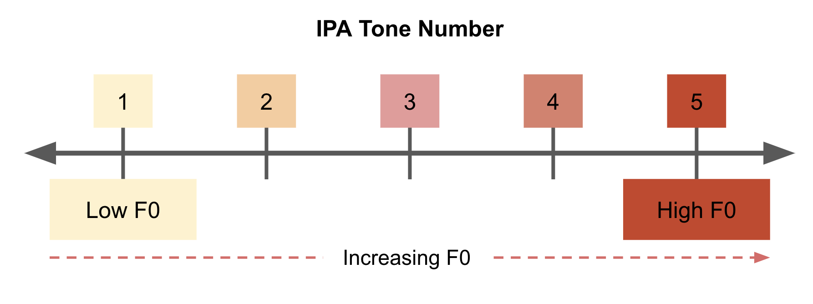
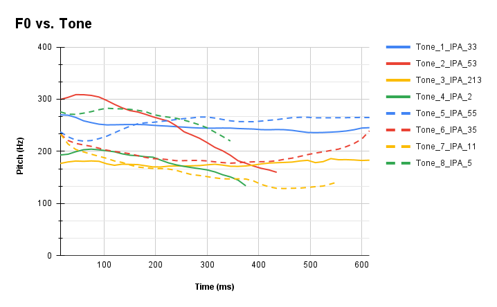

# Tones

<details open markdown="block">
  <summary>
    Table of contents
  </summary>
  {: .text-delta }
1. TOC
{:toc}
</details>
___
# Tones Introduction
1. `Pitch` refers to the number of `glottal pulses`[^9] per second (Hz)
	1. `Pitch` is an equivalent term for `Fundamental Frequency` or `F0` <small>or if you're quirky, glottal pulses per second!</small>
	2. More `glottal pulses` => higher `pitch`
2. `Tones` are `pitch` modulations (changes) throughout an utterance
	1. Ex: the IPA denoted `53` tone would be a `high pitch` at `onset` then `low pitch` following
	2. The modulation of `F0` throughout an utterance is known as a [`Pitch Contour`](#Pitch-Contour) which can be plotted as `F0 vs. Time`
4. From a `Gestural Framework`, the `goal` of `High Tone` or `Low Tone` are achieved by constrictions of the `articulators` or muscles in the lower portion of the `Vocal Tract`

|                  | High Tone                                             | Low Tone                                |
| ---------------- | ----------------------------------------------------- | --------------------------------------- |
| Tension Goal     | Increase Longitudinal Tension                         | Decrease Vertical Tension               |
| Articulator Goal | Increase Angle between Cricoid and Thyroid Cartilages | Lower Larynx                            |
| Muscle Involved  | Crico-thyroid muscle                                  | Strap muscle (sterno-hyoid/thyrohiyoid) |

# IPA Tone Transcription
<small>Due to historical reasons, the use of numerical values for tones is quite ambiguous; this section hopes to clear this ambiguity.</small>
- Following the primary resource [`Learn Teochew`'s Tones Section](https://learn-teochew.github.io/pages/pronunciation.html#tones), we will follow that on the scale of tones from `1` to `5`, the lower the number, the lower the `F0`[^7]

| Numerical IPA Tone Markings             |
| --------------------------------------- |
|  |

# List of Tones
#### Tone Class
- In `Teochew` there are 2 `Tone Classes`: either `low`[^1] or `high`[^2] `F0`
	- `low` means that the F0 begins low
	- `high` means that the F0 beings high
	- Note: after the initial onset pitch, the utterance may be modulated (either go higher or lower depending on the `Tone Category`)

| Tone Class | Starting F0 | Teochew Transcription | Corresponding IPA Tones | Corresponding Peng'im Tones |
| ---------- | ----------- | --------------------- | ----------------------- | --------------------------- |
| low        | low         | 阴                     | `33` `53` `213` `2`     | `1` `2` `3` `4`             |
| high       | high        | 阳                     | `55` `35` `11` `5`      | `5` `6` `7` `8`             |

#### Tone Category
- In addition to `Tone Class`, each Tone can be modulated with a `Tone Category` (either increase or decrease `F0` depending on the onset `F0` or `Tone Class`)

| IPA Tone Example                  | Corresponding Peng'im Tones    | F0 Modulation                                                                                                                                              | English Transcription             | Teochew Transcription     |
| --------------------------------- | ------------------------------ | ---------------------------------------------------------------------------------------------------------------------------------------------------------- | --------------------------------- | ------------------------- |
| `33`<br>`55`                      | `1`<br>`5`                     | Constant<br>                                                                                                                                               | Level<br>                         | 平<br>                     |
| `53`[^10]<br>`35`[^11]            | `2`<br>`6`                     | Starts in *opposite* `Tone Class` and ends in the `Tone Class`                                                                                             | Rising<br><br><br>                | 上<br><br><br>             |
| `213`<br>`11`<br><br><br><br><br> | `3`<br>`7`<br><br><br><br><br> | If starts with low initial`Tone Class`, `F0` dips and then rises to higher `Tone Class`<br>               <br>Constant if starts with low `Tone Class`[^5] | Departing<br><br><br><br><br><br> | 去<br><br><br><br><br><br> |
| `2`<br>`5`                        | `4`<br>`8`                     | Constant (Glottal Stop final)                                                                                                                              | Entering<br>                      | 入                         |

#### Combinatorial Tones
- Each of the categories and tones combine combinatorially to yield the tone table below

```
Total_Tones = Number_Tone_Classes * Number_Tone_Types

Total_Tones_in_SwaTao = 2 Tone Classes * 4 Tone Types
Total_Tones_in_SwaTao = 8
```

## Tone Classification
- The table below reiterates the information above and maps the relationship between **Tone Class and Tone Category** with **IPA `pitch contour`**, **`Peng'im` tone number**, and written **Chinese tone orthography**

| IPA Number | Peng’im Tone # | Tone Type (English) | Tone Class (English) | Tone Type (Teochew) | Tone Class<br>(Teochew) |
| ---------- | -------------- | ------------------- | -------------------- | ------------------- | ----------------------- |
| 33         | 1              | Low                 | Level                | 阴                   | 平                       |
| 53         | 2              | Low                 | Rising               | 阴                   | 上                       |
| 213        | 3              | Low                 | Departing            | 阴                   | 去                       |
| 2          | 4              | Low                 | Entering             | 阴                   | 入                       |
| 55         | 5              | High                | Level                | 阳                   | 平                       |
| 35         | 6              | High                | Rising               | 阳                   | 上                       |
| 11         | 7              | High                | Departing            | 阳                   | 去                       |
| 5          | 8              | High                | Entering             | 阳                   | 入                       |

___
# Pitch Contour
- Below, each of the tone modulations are plotted as `F0` vs. `Time`
- Each line type (*solid* or *dashed*) represents a `Tone Type` (*High* or *Low*) while color represents a Tone Category (*Level*, *Rising*, *Departing*, *Entering*)

#### `F0` Calculation Method
1. Since `F0` modulation occurs during the vowels rather than the short `onset` consonants, I extracted the Formant Listing during the vowels in a `/CV/` context
2. In Praat, I used `Pitch`>`Pitch Listing`
3. Plotted the tones and did not truncate the length (see tones `2` and `5` are much shorter than the rest of the tones)

| Pitch Contour                        |
| ------------------------------------ |
|  |

| Tone Parameter Type | Tone Parameter | Graph Representation |
| ------------------- | -------------- | -------------------- |
| Tone Type           | Low            | Solid Line           |
|                     | High           | Dashed Line          |
| Tone Category       | Level          | Blue                 |
|                     | Rising         | Red                  |
|                     | Departing      | Yellow               |
|                     | Entering       | Green                |

## Pitch Contour Analysis
- Comparing `Tone Type` and `Tone Category`

### `Tone Type` Analysis
- With the exception of the `Departing` tone, all `High` `Tone Type` end higher than their `Low Tone Type` counterpart
- With the exception of the `Entering` tone, all `High Tone Type` contours curve upward towards the end of the tone gesture

### `Tone Category` Analysis

| IPA Tone Example                  | Corresponding Peng'im Tones    | English Transcription             | Findings                                                                                                                                                                                      |
| --------------------------------- | ------------------------------ | --------------------------------- | --------------------------------------------------------------------------------------------------------------------------------------------------------------------------------------------- |
| `33`<br>`55`                      | `1`<br>`5`                     | Level<br>                         | `F0` seems to "settle" and hold constant after ~200 ms                                                                                                                                        |
| `53`[^10]<br>`35`[^11]            | `2`<br>`6`                     | Rising<br><br><br>                | Tone modulation starts in the opposite `Tone Type` and ends in the target `Tone Type`                                                                                                         |
| `213`<br>`11`<br><br><br><br><br> | `3`<br>`7`<br><br><br><br><br> | Departing<br><br><br><br><br><br> | `Low Tone Type` seems to follow the `213` modulation<br><br>`High Tone Type` seems to follow the opposite of `Rising` rather than `Departing` where the tone ends in the opposite `Tone Type` |
| `2`<br>`5`                        | `4`<br>`8`                     | Entering<br>                      | Both `Tone Types` contour downwards--decrease in `F0` perhaps due to the final `glottal adduction`/`glottal stop`                                                                             |

- It is not possible to directly draw a correlation between tone and vowel length as the contrastive tone pairs are not minimal. See [Future Investigations] for more details.

____
[^1]: Low is also called "Dark" or `阴` in some literature
[^2]: High also called "Light" or `阳` in some literature
[^3]: The IPA tone scale from `1`-`5` represents the range of `F0` values for a speaker where `1` is the lowest `pitch`/`f0` and `5` is the highest `pitch`/`F0`. However, the numerical values have historically been [ambiguous for Asian vs. African tone languages](https://en.wikipedia.org/wiki/Tone_letter#Numerical_values)
[^4]: Similar to Mandarin `third tone`. In addition, this is the only `Teochew` tone with more than one pitch gesture in the modulation
[^5]: See the [Pitch Contour](#Pitch-Contour) section for the discrepancy between the expected "constant" tone versus the recorded decrease in `F0`
[^9]: One `glottal pulse` is the "round trip" of the 2 halves of the vocal folds from being blown apart by the [`pulmonic airstream`](https://en.wikipedia.org/wiki/Airstream_mechanism) and pulled back together by `low pressure` created by [`Bernoulli Forces`](https://en.wikipedia.org/wiki/Bernoulli%27s_principle)
[^7]: While working on this project, I accidentally reversed the tone markings! Seems like this happens in [African vs. Asian Tone transcriptions](https://en.wikipedia.org/wiki/Tone_letter#Numerical_values) too
[^10]: `53` is `Low` `Tone Class`: `F0` Modulation goes from `High` (`5`) to `Low`(`3`)
[^11]:  `35` is `High` `Tone Class`: `F0` Modulation goes from `Low`(`3`) to `High` (`5`)

[Future Investigations]: Future_Investigations.html#tones