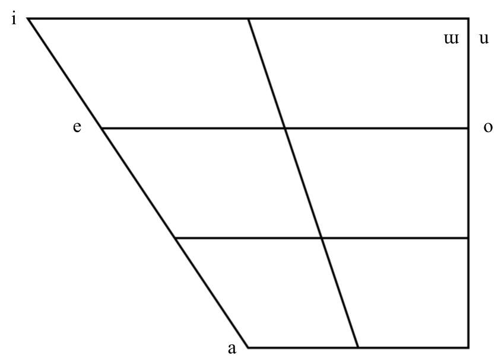
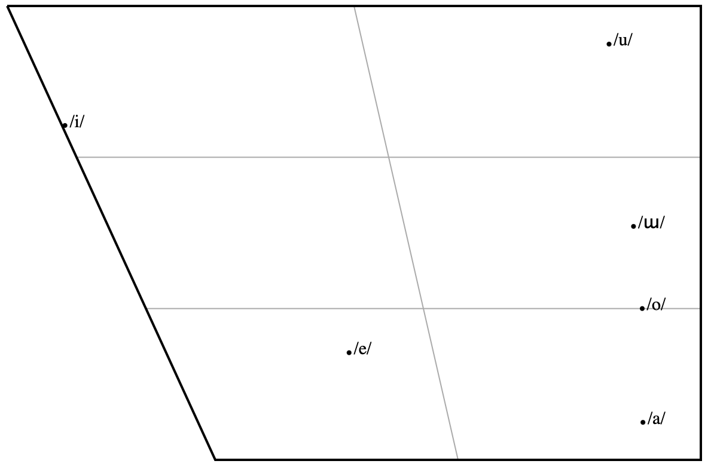
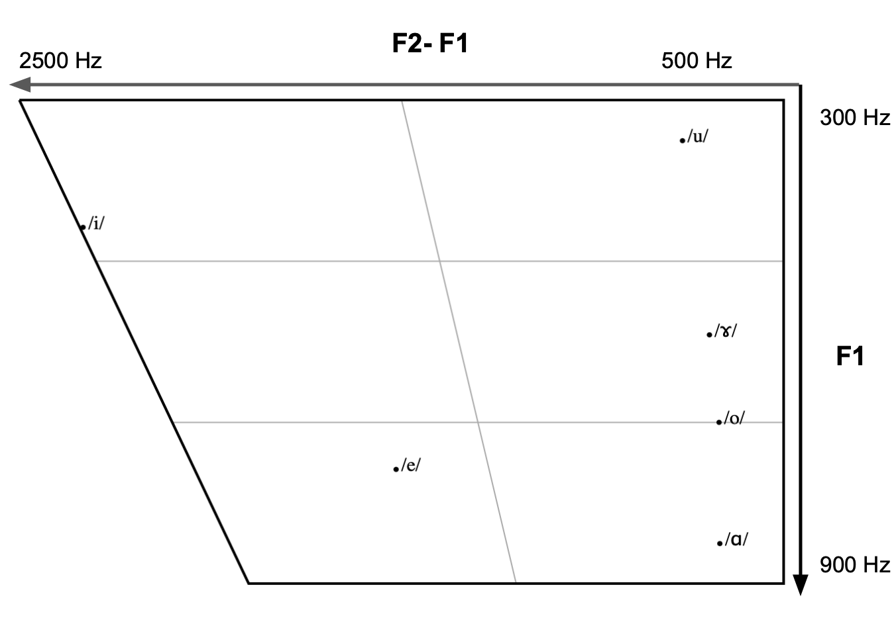
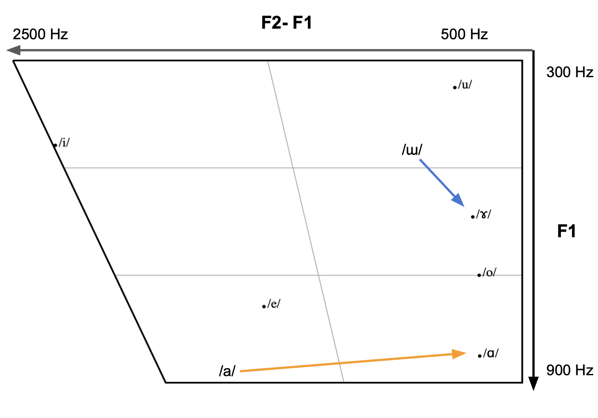
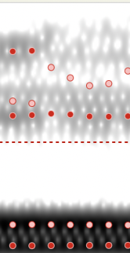
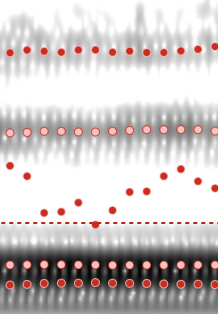
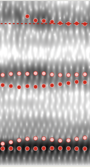
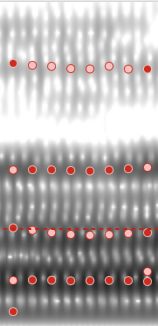
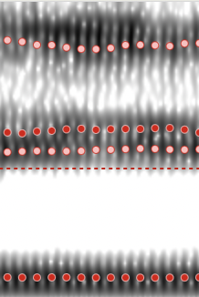
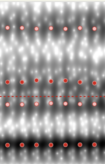

# Vowels

  

    Table of contents
  

  {: .text-delta }
1. TOC
{:toc}

___
# List of Vowels
- Although the consonants in the literature are the same as the recorded speaker, the vowels recorded by the `SwaTao` speaker differs from the expected vowels in the `Teochew Proper` literature

## Expected Vowels
- According to the `Teochew Proper` transcriptions, the below table maps the `Peng'im` Orthography to IPA

| Vowel IPA | Vowel Peng’im | IPA Transcription | Peng’im Transcription | SwaTao Gloss | Chinese Gloss | English Gloss |
| --------- | ------------- | ----------------- | --------------------- | ------------ | ------------- | ------------- |
| /i/       | i             | /mi/              | mi7                   | 面            | 面             | Noodle        |
| /e/       | ê             | /me/ /si/         | mê5 si7               | 暝时           | 夜晚            | Night         |
| /a/       | a             | /ma/              | ma5                   | 妈            | 妈             | Mom           |
| /o/       | o             | /mo/              | mo2                   | 毛            | 毛             | Fur           |
| /u/       | u             | /gu/              | ghu1                  | 牛            | 牛             | Cow           |
| /ɯ/       | e             | /kʰɯ/             | ke3                   | 去            | 去             | Go            |

| Expected Vowel Chart                        |
| ------------------------------------------- |
|  |

## Recorded Vowels
Before going into the details on the vowel identification, below details the process to I used to obtain the Vowel Charts:
#### Vowel Calculation Method
1. Since the vowel was produced in a `/CV/` context, I selected only the portion where the consonant formant modulation is not present (vowel formants become stable)
2. Used the `Formant`>`Formant Listing` from Praat
3. Took the median of the entire time series for `F2-F1` and `F1` values and plot them

### Recorded Vowel Chart with Original Vowels
- Based on the positions of `/ɯ/` and `/a/`, the there seems to be a slight lowering of `F2` in the vowel supposed to be `/ɯ/` and an extreme lowering of `F2` in the vowel supposed to be `/a/`

| Recorded Vowel Chart                                            |
| --------------------------------------------------------------- |
|  |

### Vowel Shift in `SwaTao`
- When listening to the recording combined with the new data, `SwaTao` seems to have these `/ɤ/` and `/ɑ/` rather than `/ɯ/` and `/a/`

| Peng'im | Expected Vowel | Recorded Vowel |
| ------- | -------------- | -------------- |
| a       | /a/            | /ɑ/            |
| e       | /ɯ/            | /ɤ/            

| Vowel IPA | Vowel Peng’im | IPA Transcription | Peng’im Transcription | SwaTao Gloss | Chinese Gloss | English Gloss |
| --------- | ------------- | ----------------- | --------------------- | ------------ | ------------- | ------------- |
| /ɑ/       | a             | /mɑ/              | ma5                   | 妈            | 妈             | Mom           |
| /ɤ/       | e             | /kʰɤ/             | ke3                   | 去            | 去             | Go            |

| Description                                                 | Vowel Chart                                                                          |
| ----------------------------------------------------------- | ------------------------------------------------------------------------------------ |
| Hypothesized Shifted Vowel Chart                            |  |
| Potential "Backing" shift from `Teochew Proper` to `SwaTao` |  |

#### Investigating `/e/` vs. `/ɛ/`
- Something interesting while looking at the formant chart is the `/e/` vowel having a much higher F1 then expected[^3]. 
- While this could suggest that the `/e/` vowel in `Teochew Proper` shifts to a lower F1 `/ɛ/` in `SwaTao`:
	1. `/e/` and `/ɛ/` experience `allophonic variation`[^4] in `Teochew` so it is unclear which vowel is the `phonological unit`
	2. Seeing which vowel is more prominent would require more investigation // TODO SECTION ON BIMODAL DISTRIBUTION

### Possible Reasons For Vowel Shifting
- However, it is unclear whether this shift is due to: (1) variety, (2) speaker, or (3) speaking conditions of the normal speaker.

| Possible Reason For Shifting | Description of Reason                                                                                 | Finding                                                                                                                                                                                                                     |
| ---------------------------- | ----------------------------------------------------------------------------------------------------- | :-------------------------------------------------------------------------------------------------------------------------------------------------------------------------------------------------------------------------- |
| Variety                      | The `/ɯ/` and `/a/` vowel shift to `/ɤ/` and `/ɑ/` for all `SwaTao` speakers                          | (1) There is a `Backing` of the `/ɯ/` and `/a/` vowels from `Teochew Proper` to `SwaTao` under all conditions  (2) `SwaTao` speaker's phonological unit[^1] for those 2 vowels differs from `Teochew Proper`'s        |
| Speaking Conditions          | The `Backing` only occurs in limited conditions                                                       | (1) There is a `Backing` from `Teochew Proper` to `SwaTao` under certain conditions  (2) The phonological unit for the 2 vowels are the same in `SwaTao` and `Teochew Proper` but experience allophonic variation[^2] |
| Speaker Specific             | The vowel shift is only present in the native speaker recorded and not for other speakers of `SwaTao` | (1) There is no difference in vowels between both varieties  (2) The phonological units for both varieties are the same                                                                                               |

See Section (// TODO) for future investigation of vowel shifting.
___
# Vowel Spectrograms

| Back Vowel IPA | Spectogram                                                            |
| -------------- | --------------------------------------------------------------------- |
| /u/            |                |
| /o/            |    |
| /ɤ/            |  |
| /ɑ/            |                 |

| Front Vowel IPA | Spectogram                                                   |
| --------------- | ------------------------------------------------------------ |
| /i/             |      |
| /e/             |  |

____
[^1]: Phonological Unit refers to an abstract mental unit representing the information a speaker needs to decode (understand from a speech signal) or encode (produce) a given sound. More specifically, the Phonological Unit is likely a set of `Dynamical Systems` governing the movement of `Vocal Tract Constrictors` where the target `Constriction Location` (traditionally `Place of Articulation`) and `Constriction Degree` (traditionally `Manner of Articulation`) are the `goals` of each `Dynamical System` 
[^2]: Due to the `synergy` and `interaction` of the `Dynamical Systems` controlling each `Constrictor`--in this case, `Tongue Body`--`/ɯ/` and `/a/` have greater `Pharyngeal Constriction` 
[^3]: Relating to `Source Filter Theory`, the `/e/` and `/ɛ/` vowels differ only in `Constriction Degree` at the `Palatal` `Constriction Location`. Since the `palatal` constriction occurs at an `antinode` or `maximum movement` point of air molecules in the Vocal Tract, the `antinode` is `mass controlled`. A constriction at the `mass controlled` area decreases the frequency, which means that the higher the vowel, the greater the `Constriction Degree` and the lower the `F1`. More simply `F1 and vowel height are inversely related`, lower vowels have higher `F1`s.
[^4]: Allophonic Variation refers to the idea that the same `Phonologic Unit` may be produced with different but close `Constriction Degree`s and `Constriction Location`s. Speakers would not differentiate between words/phonemes when in allophonic distribution.
